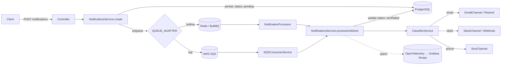

# notify-engine

A multi-channel, asynchronous notification engine built with NestJS — a technical case study exploring queue abstraction, provider-agnostic delivery channels, and observability in a distributed background-processing system.

Inspired by services like Novu, Knock, and SendGrid: applications `POST` a notification, the engine persists it, queues it, and delivers it over email, Slack, or SMS — with automatic retries, a dead-letter path, and distributed tracing across the whole flow.

## Why this project exists

This started as a migration of a .NET document-certificate system into NestJS, and grew into a deliberate exercise in software architecture: **how do you build a system where the queue technology and the delivery channel are both swappable, without either decision leaking into business logic?**

Every design decision below was driven by a real constraint that came up during development, not chosen in advance from a textbook — the [Architecture Decisions](#architecture-decisions) section explains the reasoning behind each one.

## Architecture overview



Only **one** queue provider is active at runtime, controlled by `QUEUE_PROVIDER`. When set to `sqs`, no connection to Redis is attempted at all — the BullMQ worker and queue registration are excluded from the module graph entirely, not just left idle.

## Design patterns

| Pattern | Where | Why |
|---|---|---|
| **Adapter** | `IQueue` + `BullMQQueueAdapter` + `SQSQueueAdapter` | Two unrelated queue APIs (BullMQ, AWS SQS) exposed through one contract, so the rest of the app never knows which is active. |
| **Strategy** | `IChannel` + `EmailChannel` / `SlackChannel` / `SmsChannel` | Interchangeable delivery mechanisms behind one `send()` contract. |
| **Factory** | `QUEUE_ADAPTER` provider, `ClassifierService.getChannel()` | Resolves the concrete implementation at runtime, from environment config or from the notification's channel field — never with an `if` scattered through business logic. |
| **Facade** | `NotificationsService.processAndSend()` | Single entry point hiding "find → resolve channel → send → update status → trace" from both consumers (BullMQ worker and SQS poller), guaranteeing identical behavior regardless of queue backend. |
| **Observer** | `@OnWorkerEvent()` in `NotificationProcessor` | Reacts to BullMQ's job lifecycle without coupling to its internals. |
| **Repository** | TypeORM `Repository<Notification>` | Persistence abstracted behind a query interface. |

## Architecture decisions

- **Queue abstraction (`IQueue`)** — built to prove that a notification system shouldn't be locked into one queue technology. BullMQ is used for local development (Redis-backed, fast feedback loop); SQS is the production target, emulated locally with Floci, an AWS emulator that runs in Docker. Switching is a single environment variable, not a code change.
- **Channel abstraction (`IChannel`)** — the recipient's channel (`email`, `phone`, `slack`) is explicit in the request DTO rather than inferred from the recipient's format, avoiding ambiguity (a phone number and a Slack channel name can both be arbitrary strings).
- **Centralizing `processAndSend()` in the service layer, not the workers** — initially this logic lived inside `NotificationProcessor` (BullMQ-specific). Once an SQS consumer needed the exact same behavior, duplicating it across two workers was rejected in favor of one shared method — the kind of decision that only becomes obvious once a second consumer actually exists.
- **Idempotency guard** — `processAndSend()` checks the notification's current status before sending. Without it, a retry triggered by a transient DB failure *after* a successful send would re-trigger a real email/Slack message to the recipient.
- **Failure symmetry between providers** — BullMQ's retry/DLQ semantics (`attemptsMade`, `onFailed`) have no native equivalent in SQS. `ApproximateReceiveCount` is used to reach the same effective behavior: mark `failed` and alert only after the same number of attempts, on both paths.

## Tech stack

- **Runtime:** NestJS 11, TypeScript, Node 24
- **Persistence:** PostgreSQL 16 + TypeORM
- **Queues:** BullMQ (Redis) and AWS SQS — swappable
- **Channels:** Resend (email), Slack Incoming Webhooks, SMS via Twilio (integrated, not yet verified with real credentials)
- **Observability:** OpenTelemetry → Grafana Tempo, viewed in Grafana
- **Infra (local):** Docker Compose, Floci (AWS SQS emulation)

## Getting started

### Prerequisites
- Node 24+
- Docker + Docker Compose

### Environment variables

```env
NODE_ENV=development
PORT=3000

# Database
DB_PROVIDER=postgres
DB_HOST=localhost
DB_PORT=7777
DB_NAME=notify-engine
DB_USER=admin
DB_PASSWORD=test

# Queue provider: "bullmq" or "sqs"
QUEUE_PROVIDER=bullmq

# Redis (used when QUEUE_PROVIDER=bullmq)
REDIS_HOST=localhost
REDIS_PORT=6379

# AWS / SQS (used when QUEUE_PROVIDER=sqs, emulated locally via Floci)
AWS_ENDPOINT_URL=http://localhost:4566
AWS_REGION=us-east-1
AWS_ACCESS_KEY_ID=test
AWS_SECRET_ACCESS_KEY=test
SQS_QUEUE_URL=http://localhost:4566/000000000000/notifications

# Observability
OTEL_EXPORTER_OTLP_ENDPOINT=http://localhost:4318
OTEL_SERVICE_NAME=notify-engine

# Channels
RESEND_API_KEY=
SLACK_WEBHOOK_URL=
TWILIO_ACCOUNT_SID=
TWILIO_AUTH_TOKEN=
TWILIO_FROM_NUMBER=

# API auth
API_KEY=

# Grafana admin password (read by docker-compose)
GRAFANA_ADMIN_PASSWORD=
```

### Running locally

```bash
docker compose up -d      # postgres, adminer, redis, floci, tempo, prometheus, grafana
npm install
npm run start:dev
```

Swagger docs: `http://localhost:3000/api/docs` when `NODE_ENV` is not `production` — it's disabled in prod because it has no auth of its own (unlike the `/notifications` endpoints) and exposes the full API shape.

All endpoints require an `x-api-key` header matching `API_KEY`.

### Switching queue providers

Set `QUEUE_PROVIDER=sqs` and restart — no other change is needed. With this provider, Redis is never contacted.

## Queue providers: BullMQ vs SQS

`QUEUE_PROVIDER` (env var) selects which queue backend is active — `bullmq`
or `sqs`. Only the infrastructure of the active provider is initialized at
boot: with `QUEUE_PROVIDER=sqs`, the app never registers a BullMQ queue or
worker and never opens a connection to Redis (see `QueuesModule` and
`NotificationsModule`). Both providers behave the same way when a send
fails after exhausting retries: the notification is marked `status: 'failed'`
in the database. The shared retry limit is `MAX_ATTEMPTS`
(`src/common/constants/queue.constants.ts`, currently `3`):

- **BullMQ**: `attempts: MAX_ATTEMPTS` on the job (`bull-mqqueue-adapter.ts`).
  `NotificationProcessor.onQueueFailed` marks the notification failed once
  `job.attemptsMade >= MAX_ATTEMPTS`.
- **SQS**: the consumer requests the `ApproximateReceiveCount` message
  attribute and marks the notification failed (and deletes the message)
  once that count reaches `MAX_ATTEMPTS` (`sqs-consumer.service.ts`).

### SQS: Dead Letter Queue (DLQ) and RedrivePolicy

The app only talks to `SQS_QUEUE_URL` — it doesn't provision the queue. The
consumer already marks a notification `failed` in our own DB once
`ApproximateReceiveCount` reaches `MAX_ATTEMPTS`, independent of any AWS-side
DLQ. Configuring a `RedrivePolicy` on the SQS side is still recommended so
poison messages don't loop in the main queue for other reasons (e.g. the app
being down and never getting the chance to receive/delete a message).

To keep both symmetric, set the DLQ's `maxReceiveCount` to the same value as
`MAX_ATTEMPTS` (`3`).

**Local (Floci, `dev-aws` service in `docker-compose.yml`):**

```bash
# 1. Create the DLQ
aws sqs create-queue --queue-name notifications-dlq --region us-east-1

# 2. Get the DLQ's ARN
DLQ_ARN=$(aws sqs get-queue-attributes \
  --queue-url http://localhost:4566/000000000000/notifications-dlq \
  --attribute-names QueueArn --region us-east-1 \
  --query 'Attributes.QueueArn' --output text)

# 3. Create (or update) the main queue with the RedrivePolicy pointing at the DLQ
aws sqs create-queue --queue-name notifications --region us-east-1 \
  --attributes "{\"RedrivePolicy\":\"{\\\"deadLetterTargetArn\\\":\\\"$DLQ_ARN\\\",\\\"maxReceiveCount\\\":\\\"3\\\"}\"}"
```

(`aws` here is assumed aliased with `--endpoint-url=http://localhost:4566`,
as in this project's local setup — use `--endpoint-url` explicitly otherwise.
Floci has no persistent volume in `docker-compose.yml`, so both queues need
to be recreated every time the `dev-aws` container is recreated.)

**Real AWS**: same two commands, without `--endpoint-url`, against a real
queue and region. `maxReceiveCount` must still match `MAX_ATTEMPTS`.

## API

| Method | Endpoint | Description |
|---|---|---|
| `POST` | `/notifications` | Create and queue a notification |
| `GET` | `/notifications/:id` | Fetch a single notification |
| `GET` | `/notifications` | List all notifications |
| `GET` | `/notifications/dlq/jobs` | List failed jobs (BullMQ provider only) |
| `POST` | `/notifications/dlq/:id/retry` | Manually retry a failed job (BullMQ provider only) |

## Supported channels & recipient formats

| Channel | `channel` value | `recipient` format | Example |
|---|---|---|---|
| Email | `email` (default) | Valid email address | `user@example.com` |
| SMS | `phone` | E.164 phone number | `+573001234567` |
| Slack | `slack` | Channel name starting with `#` | `#notify-engine` |

Valid `channel` values are exposed as a dropdown on the `channel` field in Swagger (`/api/docs`). The `recipient` format is validated server-side per channel by a custom `class-validator` constraint (`IsValidRecipientFormatConstraint`, in `src/notifications/dto/validators/`) — sending a mismatched format (e.g. an email address with `channel: "phone"`) returns a `400` naming the expected format for that channel.

## Known limitations

- SMS runs through Twilio (`SmsChannel`) but has not been exercised with real credentials. Without the three `TWILIO_*` variables it logs a configuration error and returns `{ success: false, error: 'Twilio client not configured' }` instead of throwing, so it never breaks the worker.
- The database schema is created by TypeORM `synchronize`, which is enabled only when `NODE_ENV=development` (`src/app.module.ts`). There are no migrations yet, so any other environment needs the schema created by hand.
- SQS's dead-letter handling relies on a `RedrivePolicy` configured directly on the queue, whose `maxReceiveCount` must match `MAX_ATTEMPTS` (`src/common/constants/queue.constants.ts`), rather than an inspection endpoint like the BullMQ one — SQS DLQs are inspected via AWS tooling, not through this API.

## License

[MIT](LICENSE)